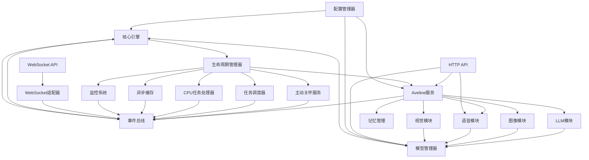
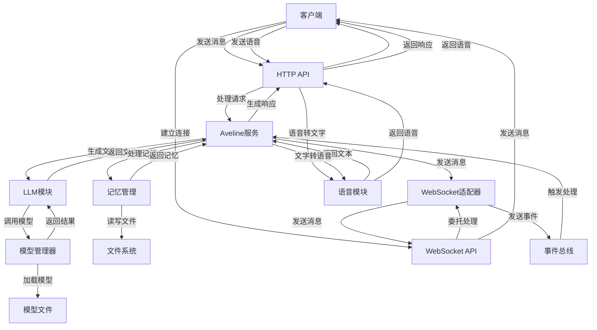
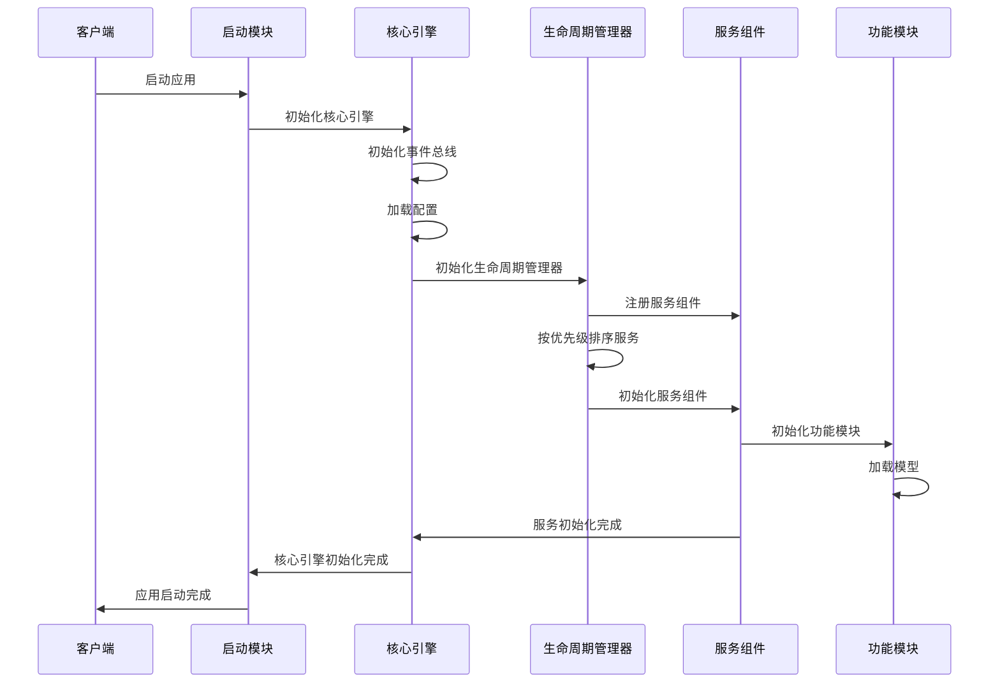
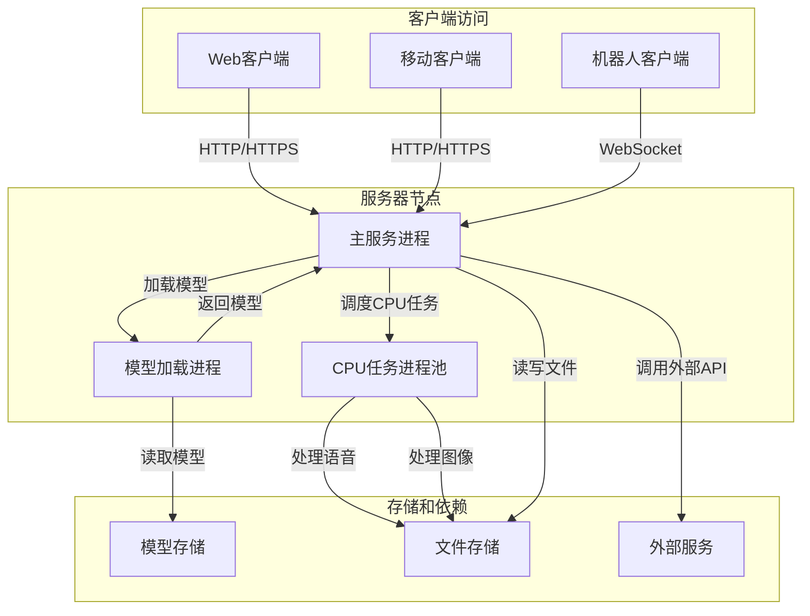

# xy-core系统架构图

## 系统架构概览

```mermaid
flowchart TD
    %% 外部层
    subgraph 外部层
        Client[客户端应用]
        ModelFiles[模型文件]
        ExternalAPIs[外部API服务]
        FileSystem[文件系统]
    end

    %% 接口层
    subgraph 接口层
        HTTP_API[HTTP API]
        WebSocket_API[WebSocket API]
    end

    %% 服务层
    subgraph 服务层
        AvelineService[Aveline服务]
        ActiveCareService[主动关怀服务]
        TaskScheduler[任务调度器 (GlobalTaskScheduler)]
        CPUTaskProcessor[CPU任务处理器 (Deprecated)]
        AsyncCache[异步缓存]
        MonitoringSystem[监控系统]
        WebSocketAdapter[WebSocket适配器]
    end

    %% 核心层
    subgraph 核心层
        CoreEngine[核心引擎]
        EventBus[事件总线]
        LifecycleManager[生命周期管理器]
        ModelManager[模型管理器]
        ConfigManager[配置管理器]
    end

    %% 模块层
    subgraph 模块层
        LLMModule[LLM模块]
        ImageModule[图像模块]
        VoiceModule[语音模块]
        MemoryModule[记忆管理]
        VisionModule[视觉模块]
    end

    %% 连接关系
    Client -->|HTTP请求| HTTP_API
    Client -->|WebSocket连接| WebSocket_API
    
    HTTP_API -->|调用| AvelineService
    HTTP_API -->|调用| VoiceModule
    HTTP_API -->|调用| ModelManager
    
    WebSocket_API -->|委托处理| WebSocketAdapter
    WebSocketAdapter -->|事件| EventBus
    
    AvelineService -->|依赖| EventBus
    AvelineService -->|使用| LLMModule
    AvelineService -->|使用| ImageModule
    AvelineService -->|使用| VisionModule
    AvelineService -->|使用| MemoryModule
    
    ActiveCareService -->|依赖| EventBus
    ActiveCareService -->|调用| AvelineService
    
    EventBus -->|分发| TaskScheduler
    TaskScheduler -->|调度| VoiceModule
    TaskScheduler -.->|兼容/已弃用| CPUTaskProcessor
    TaskScheduler -->|调度| ImageModule
    
    CPUTaskProcessor -->|执行| VoiceModule
    
    AsyncCache -->|依赖| EventBus
    
    MonitoringSystem -->|监控| CoreEngine
    MonitoringSystem -->|监控| ModelManager
    
    CoreEngine -->|管理| EventBus
    CoreEngine -->|管理| LifecycleManager
    
    LifecycleManager -->|初始化/关闭| AvelineService
    LifecycleManager -->|初始化/关闭| ActiveCareService
    LifecycleManager -->|初始化/关闭| TaskScheduler
    LifecycleManager -->|初始化/关闭| CPUTaskProcessor
    LifecycleManager -->|初始化/关闭| AsyncCache
    LifecycleManager -->|初始化/关闭| MonitoringSystem
    
    ModelManager -->|加载/卸载| ModelFiles
    ModelManager -->|调用| LLMModule
    ModelManager -->|调用| ImageModule
    ModelManager -->|调用| VoiceModule
    ModelManager -->|调用| VisionModule
    
    LLMModule -->|使用| ModelFiles
    LLMModule -->|调用| ExternalAPIs
    
    ImageModule -->|使用| ModelFiles
    
    VoiceModule -->|使用| FileSystem
    
    MemoryModule -->|使用| FileSystem
    
    ConfigManager -->|配置| CoreEngine
    ConfigManager -->|配置| ModelManager
    ConfigManager -->|配置| AvelineService
```

## 功能模块关系图



## 数据流图



## 系统启动流程



## 关键组件说明

### 1. 核心层组件

#### Core Engine（核心引擎）
- 系统的核心控制器，管理所有组件的生命周期
- 提供统一的接口访问系统核心功能
- 实现单例模式，确保全局只有一个实例

#### Event Bus（事件总线）
- 实现组件间的解耦通信
- 支持异步事件发布和订阅
- 提供事件过滤器和优先级机制
- 支持异常隔离和事件链组合

#### Lifecycle Manager（生命周期管理器）
- 统一管理所有异步服务的初始化和关闭
- 支持服务优先级管理
- 提供健康检查机制

#### Model Manager（模型管理器）
- 使用单例模式集中管理所有模型的加载、卸载和检查
- 防止重复加载和内存溢出
- 支持量化加载选项和显存/资源检测
- 提供模型健康检查和状态监控

### 2. 服务层组件

#### Aveline Service（Aveline服务）
- 实现情感智能体的核心功能
- 处理用户消息，生成响应
- 管理情感状态和记忆
- 协调各个功能模块的工作

#### Active Care Service（主动关怀服务）
- 实现主动关怀功能
- 定期生成问候消息
- 监控用户状态，提供主动服务

#### Task Scheduler（任务调度器 - GlobalTaskScheduler）
- 统一全局任务调度器，管理系统中的所有后台任务
- 整合了CPU和GPU任务调度能力，支持任务优先级和依赖关系
- 提供任务提交、取消、查询等统一管理接口
- 取代了原有的独立CPU任务处理器，实现了资源的统一调度

#### CPU Task Processor（CPU任务处理器 - Deprecated）
- [已弃用] 原CPU密集型任务处理器
- 功能已被 GlobalTaskScheduler 接管
- 保留仅为了向后兼容，不建议新代码使用

### 3. 功能模块

#### LLM Module（大语言模型模块）
- 提供大语言模型的封装和调用接口
- 支持多种模型类型和量化选项
- 处理文本生成和理解任务

#### Image Module（图像模块）
- 处理图像生成和理解任务
- 支持图像生成、编辑和分析

#### Voice Module（语音模块）
- 提供语音合成和识别功能
- 支持多种语音模型和参数调整

#### Memory Module（记忆管理）
- 管理用户和系统的记忆
- 支持记忆的存储、检索和更新
- 实现记忆的优先级管理

#### Vision Module（视觉模块）
- 处理视觉理解和分析任务
- 支持图像识别、目标检测等功能

### 4. 接口层组件

#### HTTP API
- 提供RESTful接口
- 处理客户端的HTTP请求
- 支持多种功能端点

#### WebSocket API
- 提供实时通信功能
- 支持双向消息传递
- 处理客户端的WebSocket连接

## 架构设计特点

1. **三层异步隔离架构**
   - 协程级I/O隔离
   - CPU任务隔离
   - 异构任务分发

2. **模块化设计**
   - 组件化程度高，易于扩展和维护
   - 模块间通过事件总线通信，解耦性好
   - 支持动态加载和卸载模块

3. **高可用性**
   - 实现了完善的错误处理机制
   - 提供了健康检查和监控功能
   - 支持服务的自动恢复

4. **高性能**
   - 充分利用异步编程模型
   - 实现了任务的高效调度和执行
   - 优化了模型加载和管理

5. **可扩展性**
   - 支持多种模型和服务的集成
   - 提供了插件式的扩展机制
   - 支持自定义服务和模块

## 技术栈

- **后端框架**：FastAPI
- **异步编程**：asyncio
- **机器学习框架**：PyTorch、Transformers
- **模型量化**：BitsAndBytes
- **语音处理**：TTS、PyAudio
- **图像处理**：Pillow、OpenCV
- **监控和日志**：psutil、structlog
- **配置管理**：PyYAML、Pydantic

## 部署架构


