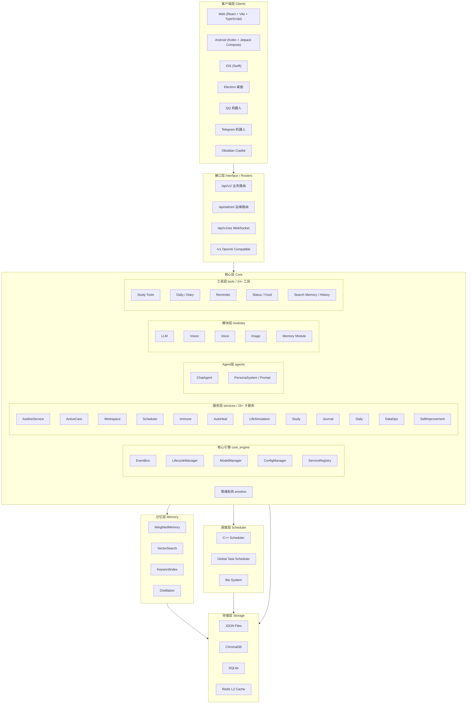

# Xiaoyou Core (小优核心)

<div align="center">
  <strong>High-Performance Asynchronous AI Agent Core for Resource-Constrained Environments</strong>
  <br>
  <em>Version 3.2.0 (Stable Release)</em>
</div>

## Abstract

**Xiaoyou Core** is a high-performance, asynchronous AI Agent infrastructure designed for resource-constrained environments. It features a hybrid **Python (FastAPI) + C++ (Scheduler)** architecture that enables efficient resource isolation and scheduling for LLM inference (GPU), TTS (CPU), and image generation tasks. Key capabilities include a sophisticated **Anthropomorphic Biological System** for simulating emotions and circadian rhythms, seamless **VTube Studio integration** for expressive 2D avatar interaction, and a self-healing **Immune System** for robust service availability. With support for multimodal interaction (Voice, Vision, Text), dynamic persona management, and cross-platform clients (Web, Mobile, Desktop, QQ Bot, Telegram), Xiaoyou Core provides a complete solution for building intelligent, lifelike AI companions.

***

## 项目简介

小优核心是一个基于大语言模型的智能AI伴侣系统，具备情感交互、记忆管理、主动关怀、多模态处理等核心能力。系统采用 **Python (FastAPI) + C++ (Scheduler)** 混合架构，结合Python高层业务逻辑与C++高性能调度引擎，支持本地部署和云端扩展。

### 核心特性

- **智能对话**: 基于LLM的自然语言理解与生成
- **情感系统**: 13种基本情绪的动态管理
- **记忆系统**: 权重记忆、向量检索、概率召回（36个核心模块）
- **主动关怀**: 上下文感知的主动交互
- **多模态**: 图像生成、视觉理解、语音合成/识别
- **生物模拟**: 神经递质系统、能量系统、昼夜节律
- **自愈系统**: 免疫系统 + AutoHeal 7层安全机制 + DataOps 数据运维
- **自我改进**: SelfImprovement 6种纠正信号 + 知识晋升 + 漂移防护
- **多端支持**: Web、Android、iOS、Electron、QQ机器人、Telegram

### 详细文档

| 文档                                       | 路径                               | 说明            |
| ---------------------------------------- | -------------------------------- | ------------- |
| [技术参考文档](PROJECT_TECHNICAL_REFERENCE.md) | `PROJECT_TECHNICAL_REFERENCE.md` | 完整的技术架构参考     |
| [核心技术亮点](TECHNICAL_HIGHLIGHTS.md)        | `TECHNICAL_HIGHLIGHTS.md`        | 12个核心技术亮点深度解析 |
| [更新日志](UPDATES.md)                       | `UPDATES.md`                     | 最新更新记录        |

### 各系统模块文档

| 模块    | 文档路径                                                                        |
| ----- | --------------------------------------------------------------------------- |
| 客户端层  | [clients/README.md](clients/README.md)                                      |
| QQ机器人 | [clients/bots/README.md](clients/bots/README.md)                            |
| Web前端 | [clients/frontend/README.md](clients/frontend/README.md)                    |
| 核心层   | [core/README.md](core/README.md)                                            |
| 核心引擎  | [core/core_engine/README.md](core/core_engine/README.md)                    |
| 服务层   | [core/services/README.md](core/services/README.md)                          |
| 调度服务  | [core/services/scheduler/README.md](core/services/scheduler/README.md)      |
| 主动关怀  | [core/services/active\_care/README.md](core/services/active_care/README.md) |
| 记忆系统  | [memory/README.md](memory/README.md)                                        |
| 路由层   | [routers/README.md](routers/README.md)                                      |
| 测试系统  | [tests/README.md](tests/README.md)                                          |
| 维护工具  | [maintenance/README.md](maintenance/README.md)                              |
| 学习工具  | [core/tools/study/README.md](core/tools/study/README.md)                    |

***

## 最新动态

请查看 [UPDATES.md](UPDATES.md) 获取最新更新日志。

***

## 核心技术亮点

🚀 **核心技术亮点深度解析**: 查看项目的12个最具特色和技术难度的核心技术亮点：

| 亮点               | 说明                    |
| ---------------- | --------------------- |
| C++资源隔离调度器       | 硬件级资源隔离，GPU/CPU任务分离调度 |
| 拟人化生物系统          | 神经递质模拟、昼夜节律、认知延迟      |
| 全链路GPU语音管线       | TTS/STT GPU加速，CPU自动回退 |
| 贪婪式模型恢复策略        | OOM自动恢复，模型热切换         |
| 免疫系统自愈机制         | 服务监控、自动重启、资源保护        |
| 概率召回记忆系统         | 权重记忆、向量检索、记忆蒸馏        |
| VTube Studio深度集成 | 情绪同步、双向通信、表情触发        |
| 事件驱动架构           | EventBus、模块解耦、异步处理    |
| 多模态融合处理          | 图像生成、视觉理解、语音交互        |
| 全局背压机制           | 任务队列、优先级调度、过载保护       |
| Active Care主动关怀  | 上下文感知、智能决策、硬件联动       |
| Study智能学习模块      | 多学科工具、3D可视化、题目生成      |

📖 详细内容请阅读: [TECHNICAL\_HIGHLIGHTS.md](./TECHNICAL_HIGHLIGHTS.md)

***

## 系统架构



小优核心采用清晰的分层架构设计：

| 层级   | 目录                | 职责                                  |
| ---- | ----------------- | ----------------------------------- |
| 客户端层 | `clients/`        | Web、Android、iOS、Electron、QQ/Telegram机器人 |
| 接口层  | `routers/`        | v1/ 业务路由 + admin/ 运维路由、WebSocket实时通信 |
| 核心层  | `core/`           | 服务注册中心、服务层(25个子模块)、模块层、管理器、工具层      |
| 记忆层  | `memory/`         | 权重记忆(36个核心模块)、向量检索、缓存系统             |
| 调度层  | `cpp_modules/cpp_scheduler/`  | C++高性能调度引擎（bio/client/inference/lifecycle/model/task/utils） |
| 存储层  | `companion_data/` | 用户数据与角色数据分仓的JSON存储                  |

***

## 快速开始

### 环境要求

| 组件      | 要求             |
| ------- | -------------- |
| Python  | 3.10+          |
| Node.js | 18+            |
| CUDA    | 11.8+ (GPU推理)  |
| 内存      | 16GB+ (推荐32GB) |
| GPU显存   | 8GB+ (推荐12GB)  |
| SoX / FFmpeg | 仅相关语音功能需要，需单独提供可执行文件 |

### 安装与启动

1. **安装 Python 依赖**:
   ```powershell
   # Windows 默认 CPU 运行环境；两步必须分开执行
   .\venv_cpu\Scripts\python.exe -m pip install -r requirements\base.txt
   .\venv_cpu\Scripts\python.exe -m pip install -r requirements\cpu.txt

   # 验证完整性
   .\venv_cpu\Scripts\python.exe tests\scripts\environment\verify_runtime_dependencies.py --environment cpu
   ```
   GPU 环境对应使用 `venv_core` 和 `requirements/gpu.txt`。`pyproject.toml` / `uv.lock`
   用于项目包直接依赖与跨平台解析，完整 Windows 环境的安装顺序见
   [`requirements/README.md`](requirements/README.md)。
2. **配置**:
   ```bash
   cp config/config_example.py config/config.py
   cp .env.example .env
   ```
3. **启动服务**:
   ```bash
   # Windows
   start_scripts\start_services.bat

   # Linux/Mac
   python main.py
   ```
4. **访问前端**:
   - Web端: <http://localhost:8000>
   - API文档: <http://localhost:8000/docs>

***

## 项目结构

```
xiaoyou-core/
├── clients/                   # 客户端层
│   ├── bots/                  # 机器人适配器 (QQ/Telegram)
│   │   ├── handlers/          # 业务逻辑处理模块
│   │   ├── qq_adapter_main.py # QQ适配器主入口
│   │   └── telegram_adapter.py # Telegram适配器
│   └── frontend/              # 前端项目
│       ├── aveline-web/       # Web前端 (React + Vite)
│       ├── aveline-android/   # Android原生应用
│       ├── aveline-ios/       # iOS原生应用 (Swift)
│       └── aveline-electron/  # Electron桌面应用
├── core/                      # 核心层
│   ├── core_engine/           # 服务注册中心（EventBus/ServiceRegistry/ServiceSingletons/LifecycleManager）
│   ├── api/                   # API 契约层（contract/error_response）
│   ├── managers/              # 业务管理器（通知/偏好/会话）
│   ├── env/                   # 虚拟环境间通信
│   ├── lifecycle/             # 应用生命周期管理
│   ├── modules/               # 模块层 (LLM/Vision/Memory/Voice)
│   ├── services/              # 服务层（25个子模块）
│   │   ├── aveline/           # Aveline对话服务
│   │   ├── active_care/       # 主动关怀服务（含 QQ 连接解析器）
│   │   ├── scheduler/         # 调度服务（bio/client/inference/lifecycle/model/task/utils）
│   │   ├── workspace/         # 工作空间服务
│   │   ├── immune/            # 免疫系统服务
│   │   ├── auto_heal/         # 自愈服务（7层安全机制）
│   │   ├── data_ops/          # 数据运维服务（三级异步Worker）
│   │   ├── self_improvement/  # 自我改进服务（6种纠正信号）
│   │   ├── remote_ops/        # 远程操作服务（审批流）
│   │   ├── discovery/         # 服务发现
│   │   ├── maintenance/       # 维护服务
│   │   ├── command/           # 命令处理
│   │   ├── communication/     # 通信服务
│   │   ├── intent/            # 意图识别
│   │   ├── reaction/          # 反应系统
│   │   ├── user_physiology/   # 用户生理
│   │   ├── vtube/             # VTube Studio集成
│   │   ├── study/             # 学习系统
│   │   ├── dual_role/         # 双角色系统
│   │   ├── aveline_life/      # Aveline生命系统
│   │   ├── life_simulation/   # 生命模拟
│   │   ├── daily/             # 日常服务
│   │   ├── journal/           # 日志服务
│   │   ├── metacognition/     # 元认知
│   │   └── monitoring/        # 监控服务
│   ├── tools/                 # 工具层（含 file_tool_base.py 公共基类）
│   ├── emotion/               # 情绪系统
│   ├── voice/                 # 语音处理（engines/ 子目录）
│   ├── middleware/             # 中间件（安全/认证/速率限制）
│   └── interfaces/            # 接口层（WebSocket adapters/handlers）
├── memory/                    # 记忆系统
│   ├── core/                  # 核心操作模块（36个模块文件）
│   └── weighted_memory_manager.py
├── routers/                   # 路由层（v1/ 业务 + admin/ 运维）
│   ├── v1/                    # 业务路由（chat/food/health/life/media/memory/models/personas/sessions/user/vision/workspace...）
│   ├── admin/                 # 运维路由（auto_heal/data_ops/remote_ops）
│   ├── openai_compat.py       # OpenAI兼容API
│   └── websocket.py           # WebSocket路由
├── cpp_modules/cpp_scheduler/ # C++调度引擎
├── config/                    # 配置管理
├── tests/                     # 测试系统
├── maintenance/               # 维护工具
├── scripts/                   # 脚本工具
├── main.py                    # 主入口
└── server_run.py              # 服务器启动
```

***

## API 参考

### HTTP API

路由层采用 `v1/`（业务）+ `admin/`（运维）分域结构：

**业务路由** (`/api/v1/` 前缀)：

| 路由前缀                  | 说明          |
| --------------------- | ----------- |
| `/api/v1/chat`        | 聊天相关API     |
| `/api/v1/image`       | 图像生成API     |
| `/api/v1/memory`      | 记忆管理API     |
| `/api/v1/study`       | 学习功能API     |
| `/api/v1/system`      | 系统状态API     |
| `/api/v1/workspace`   | 工作空间API     |
| `/api/v1/media`       | 多媒体处理API    |
| `/api/v1/health`      | 健康检查API     |
| `/api/v1/models`      | 模型管理API     |
| `/api/v1/personas`    | 人设管理API     |
| `/api/v1/plugins`     | 插件管理API     |
| `/api/v1/sessions`    | 会话管理API     |
| `/api/v1/user`        | 用户管理API     |
| `/api/v1/food`        | 饮食管理API     |
| `/api/v1/life`        | 生命模拟API     |
| `/api/v1/vision`      | 视觉理解API     |
| `/api/v1/diary`       | 日记API       |
| `/api/v1/peer-chat`   | 同伴对话API     |
| `/api/v1/tasks`       | 任务管理API     |
| `/api/v1/tutor`       | 辅导API       |
| `/api/v1/vocab`       | 词汇API       |
| `/v1`                 | OpenAI兼容API |

**运维路由** (`/api/admin/` 前缀)：

| 路由前缀                    | 说明        |
| ----------------------- | --------- |
| `/api/admin/auto-heal`  | 自愈服务管理API |
| `/api/admin/data-ops`   | 数据运维API   |
| `/api/admin/remote-ops` | 远程操作API   |

### WebSocket

- **路径**: `/api/v1/ws`
- **功能**: 实时消息推送、流式对话、心跳检测、主动关怀通知

***

## 技术栈

| 层级    | 技术栈                                    |
| ----- | -------------------------------------- |
| 后端框架  | FastAPI + Uvicorn                      |
| 前端框架  | React 18 + TypeScript + Vite           |
| 移动端   | Android (Kotlin) + iOS (Swift)         |
| 桌面端   | Electron                               |
| LLM推理 | llama-cpp-python (GGUF) / Transformers |
| 调度引擎  | C++ (自定义调度器)                           |
| 数据库   | JSON文件存储 + ChromaDB向量库                 |
| 状态管理  | Zustand (前端)                           |

***

## 配置说明

支持通过前端 UI 动态配置，或修改配置文件：

| 配置文件                          | 说明    |
| ----------------------------- | ----- |
| `config/yaml/app.yaml`        | 主配置文件 |
| `config/integrated_config.py` | 集成配置  |
| `.env`                        | 环境变量  |

```yaml
# 示例配置
llm:
  backend: "cpp"  # cpp | python | cloud
  model_path: "models/qwen-7b.gguf"

vtube:
  enabled: true
  host: "127.0.0.1"
  port: 8001

immune_system:
  enabled: true
  check_interval: 60
```

***

## 贡献指南

欢迎提交 Pull Request！请遵循以下规范：

- **Python**: PEP 8 规范
- **前端**: ESLint + Prettier
- **文档**: Markdown 规范
- **测试**: 确保通过所有测试用例

详细技术文档请参阅 [PROJECT\_TECHNICAL\_REFERENCE.md](PROJECT_TECHNICAL_REFERENCE.md)。

***

## License

AGPLv3

Copyright (C) 2026 hakituo. 本项目基于 GNU AGPLv3 许可证发布：允许商业使用与修改，但修改后的网络服务部署同样需要开放相应源码；详情见 [LICENSE](LICENSE)。
